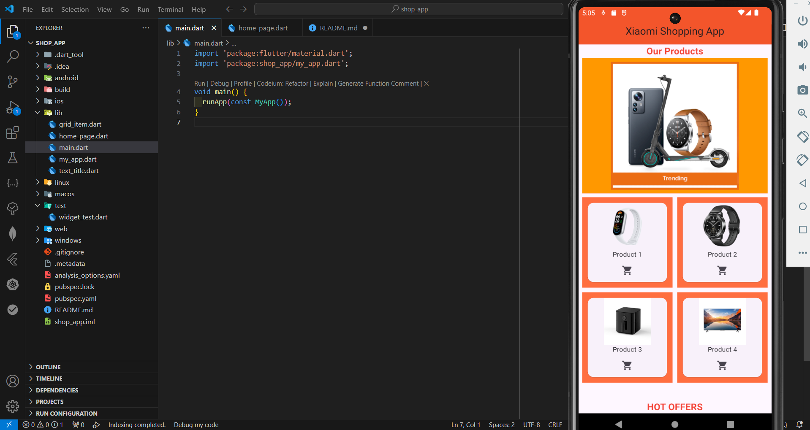
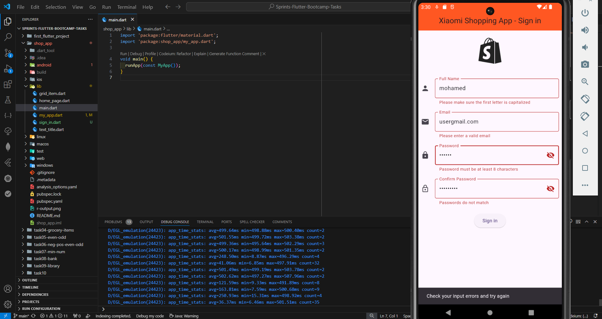
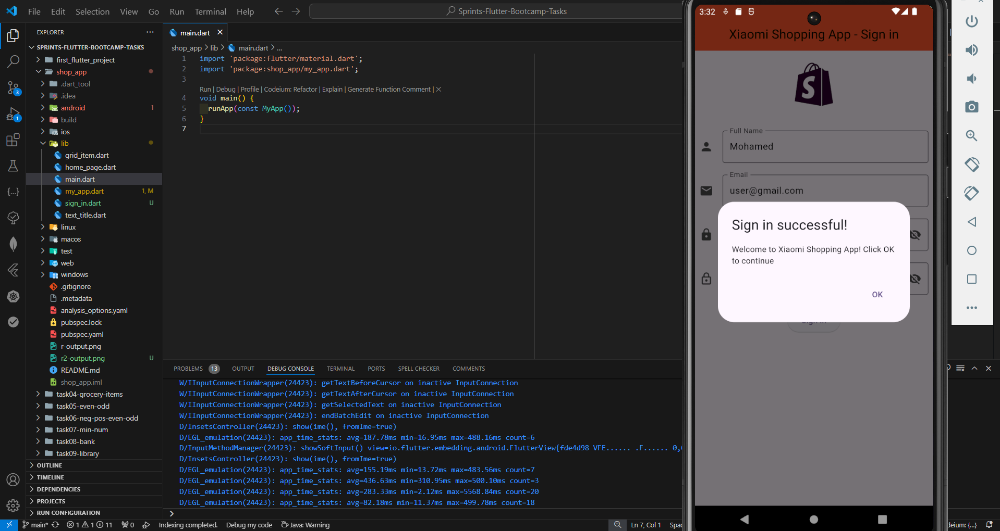

# Xiaomi Shopping App

## Description  
This Flutter project is a simple shopping app showcasing products from Xiaomi. It includes a **PageView** for product images, a **GridView** for displaying products in a grid format, and a **ListView** to show hot offers. The app also features a custom `textTitle` widget for headers and a `gridItem` widget to display individual products.

## Features  
- Displays a title at the top of the page with a custom `AppBar` in **deep orange**.
- The homepage includes:
  - A `PageView` to swipe through featured product images.
  - A `GridView` to display a list of products in a 2x2 grid format.
  - A `ListView` that lists products with images, titles, and an info icon.
- The app is responsive and adapts to different screen sizes with the use of `MediaQuery`.
- Each class/widget is in a separate file to maintain a clean and modular structure.

## Code Explanation  

### Main Function  
The `MyHomePage` widget is the entry point for the homepage of the app.

### `MyHomePage` Widget  
This is a `StatefulWidget` that contains the main UI of the app. The widget is composed of:
1. **AppBar**:
   - Displays the title "Xiaomi Shopping App" at the top of the page with a **deep orange** background.
2. **Body**:
   - A `SingleChildScrollView` ensures the page is scrollable.
   - A `Column` widget with multiple sections:
     - **Featured Products**: 
       - A `PageView` that contains product images in a swipeable layout.
     - **Products Grid**: 
       - A `GridView.builder` to display products in a 2x2 grid format.
     - **Hot Offers**:
       - A `ListView.builder` to display product offers in a list format with an image, title, and info icon.

### Sample Output  

 
 
 

# Updates: for sign up page task

Added a **Sign In Screen** for the Xiaomi Shopping App. Implementing the functionality for user input validation, password visibility toggle, and navigation to the home page upon successful sign-in.

## Features

- **User Input Fields**: 
  - Full Name
  - Email
  - Password
  - Confirm Password
- **Form Validation**:
  - Full Name must be capitalized.
  - Email must be a valid email format.
  - Password must be at least 8 characters.
  - Password confirmation must match the password.
- **Password Visibility Toggle**:
  - Show or hide the password using a visibility icon.
- **Success Dialog**:
  - Displays a welcome message on successful sign-in.
  - Navigates to the home page.

## UI Components
- **Form Fields**:
  - Custom validation for each input field.
  - Icons for better visual representation.
- **Button**:
  - "Sign in" button to submit the form.

## Navigation
- Successful sign-in triggers:
  1. A dialog box with a success message.
  2. Navigation to the `MyHomePage` (home screen).

### Sample Output  

 

 
 

# Updates: added page fade-animation from sign-in to home page
### I used the package "page_transition" to add the fade animation in the navigator -   Click below and Check it out
[Page Animation Video](PageAnimation.mp4)

 
 

# Updates: added Localization
### I used the package "easy_localization" to add localization to my app
added a language button on the app bar which opens a dialog to choose between languages to apply to the app